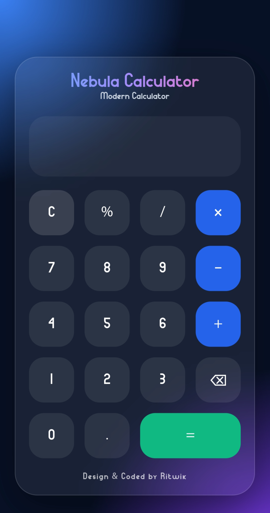

  

Nebula Calculator

A simple and modern calculator built using vanilla HTML, CSS and JavaScript.

Features

- Responsive layout for mobile and desktop
- Clean glassmorphism-inspired interface
- Keyboard support
- Smooth button animations
- Lightweight with no external dependencies

Tech Stack

- HTML
- CSS
- JavaScript

Getting Started

Clone the repository and open "index.html" in your browser.

git clone https://github.com/ritwikxd1/nebula-calculator.git

Live Demo

https://calculator.visiblemc.xyz/

Author

Designed and developed by Ritwik.
